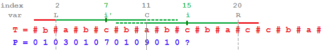

## 算法1 时间复杂度O(n^3)

- 朴素算法，找出所有连续子串。找出最长的。

```js
for (var i = 0, len = s.length; i < len; ++i) {
  for (var j = i, len = s.length; j <len; ++j) {
    check if s.substring(i, j) is Palindromic substring O(n)
  }
}
```

## 算法2 时间复杂度O(n^2)

- 遍历字符串，以某个元素为中心向左右拓展判断是否为回文串。需要分别处理回文串为奇数、偶数时的情况。

- 也可以通过预处理，将字符串处理为以某个字符间隔的方式(接下来算法3会提到)，来回避奇偶不同情况，但是会照成复杂度上升为O((2n)^2)，虽然数量级还是O(n^2)，但是会有大量冗余计算。

## Manacher算法 时间复杂度O(n)

- 线性时间内处理最长回文串的算法，本质上是基于算法2的改进。

- 考虑算法2，当计算的某个结点处在一个已经被计算过的回文串中时(一定是在右半部分)，可以利用回文串对称性，从左半部分的对称处的点中获取一些有用的信息来减少计算。

- 如下图所示：

<center>  </center>

- 设 C 为一个已经计算过的回文串的中心点，R为这个回文串的右边界。i为当前节点，i'为当前节点相对C对称点

- 有公式 p[i] = min(p[i'], R - i)，这里算的p[i]为的最小值，稍后会详细解释。

- |R - i| = |L - i'|为右边界到i点的距离(同时等于左边界到i'点的距离)

- p[i']为i的对称点i'的回文串长度

  - 当p[i'] >= |R - i| = |L - i'|时，可知 p[i] 一定大于等于|L - i'|，根据对称性回文串到右边界R都是已知的，所以p[i]=|R - i|一定成立。

  - 当p[i'] < |R - i| = |L - i'|时，由对称性可知，p[i]一定等于p[i']，根据对称性，p[i']在回文串左边界L以内，p[i]的右边界一定不可能超出R。

- 当i > R时，还是只能用算法2的方式计算回文串，但是这里会更新R。如果i + p[i] > R，则更新R为i + p[i]; 更新C为i。这样保证任意回文串的右半部分都不会被重复计算。

## 参考资料：
```
http://articles.leetcode.com/longest-palindromic-substring-part-ii/
http://www.cnblogs.com/TenosDoIt/p/3675788.html
```


